# Fundamentals of Regression by Machine Learning
---
My Studying Log of fundamentals about Machine Learning Regression.

## Table of contents
---
<!-- TOC -->

- [Fundamentals of Regression by Machine Learning](#fundamentals-of-regression-by-machine-learning)
    - [Table of contents](#table-of-contents)
    - [Introduction](#introduction)
    - [Author](#author)
    - [Linear model with 1 dimensional input](#linear-model-with-1-dimensional-input)
        - [Input data: Age](#input-data-age)
        - [Target data: Height](#target-data-height)
        - [Data generation](#data-generation)
        - [Linear model definition](#linear-model-definition)
        - [Gradient method](#gradient-method)
        - [Learning Result](#learning-result)
        - [Point to notice](#point-to-notice)
    - [Plane model with 2 dimensional input](#plane-model-with-2-dimensional-input)
        - [Data generation](#data-generation-1)
        - [Plane model](#plane-model)
    - [D-dimensional Linear Regression Model](#d-dimensional-linear-regression-model)
        - [Solution of model](#solution-of-model)
        - [Extension to plane not passing through origin](#extension-to-plane-not-passing-through-origin)
    - [Linear basis function](#linear-basis-function)
    - [Overfitting problem](#overfitting-problem)
    - [Hold-out validation](#hold-out-validation)
    - [Cross-validation](#cross-validation)

<!-- /TOC -->

## Introduction
---
This is my studying log about machine learning, regression. I referred to a following book.  
[Pythonで動かして学ぶ! あたらしい機械学習の教科書](https://www.amazon.co.jp/Python%E3%81%A7%E5%8B%95%E3%81%8B%E3%81%97%E3%81%A6%E5%AD%A6%E3%81%B6%EF%BC%81-%E3%81%82%E3%81%9F%E3%82%89%E3%81%97%E3%81%84%E6%A9%9F%E6%A2%B0%E5%AD%A6%E7%BF%92%E3%81%AE%E6%95%99%E7%A7%91%E6%9B%B8-%E4%BC%8A%E8%97%A4-%E7%9C%9F-ebook/dp/B078767Y56/ref=sr_1_12?__mk_ja_JP=%E3%82%AB%E3%82%BF%E3%82%AB%E3%83%8A&keywords=%E6%A9%9F%E6%A2%B0%E5%AD%A6%E7%BF%92&qid=1556694357&s=gateway&sr=8-12)  
I extracted some important points and some related sample python codes and wrote them as memo in this article.  

## Author
---
[Makoto Ito](https://researchmap.jp/itomakoto/)

## Linear model with 1 dimensional input
---
### Input data: Age  
$$
  \bm{x} = \left(
    \begin{array}{c}
      x_0 \\
      x_1 \\
      \vdots \\
      x_n \\
      \vdots \\
      x_{N-1}
    \end{array}
  \right)
$$

### Target data: Height  
$$
  \bm{t} = \left(
    \begin{array}{c}
      t_0 \\
      t_1 \\
      \vdots \\
      t_n \\
      \vdots \\
      t_{N-1}
    \end{array}
  \right)
$$

$N$ means the number of people and $N = 20$. A purpose of this regression is predicting a height with an age of a person who is not included the databases.  

### Data generation
This data was generated by generate_1dimensional_linear_data.py
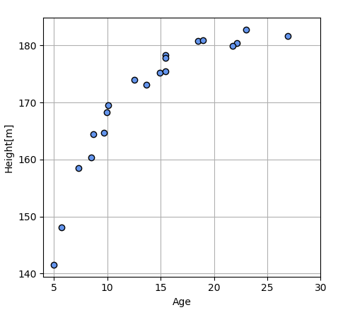

### Linear model definition

* Linear equation:
$$
  y_n = y(x_n) = w_0x_n + w_1
$$

* Mean squared error function:
$$
  J = \frac{1}{N}\sum_{n=0}^{N-1}(y_n - t_n)^2
$$

* plot relationship between $w$ and $J$:  
This figure was created by mean_squared_error_function.py
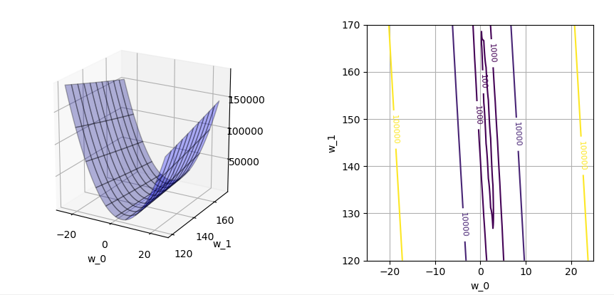

We need to decide $w_0$ and $w_1$ which minimize mean squared error, $J$. Depend on the above graph, $J$ has a shape like a valley. And then, the value of $J$ is changing to the direction of $w_0$, $w_1$. 
When $w_0$ is about 3 and $w_1$ is about 135, $J$ will be minimized.  

### Gradient method
Gradient method is used for calculating $w_0$ and $w_1$ which minimize the value of $J$. This method rpeat the following calculation:
1. Select a initial point, $w_0$ and $w_1$ on the valley of $J$.
2. calculate a gradient at the selected point.
3. $w_0$ and $w_1$ are moved to the direction which the value of $J$ most decline.
4. Finally, $w_0$ and $w_1$ will reach values which minimize the value of $J$.

* Gradient to the going up direction:
$$
  \nabla_{wJ} = \left[
    \begin{array}{c}
      \frac{\delta J}{\delta w_0} \\
      \frac{\delta J}{\delta w_1}
    \end{array}
  \right] = \left[
    \begin{array}{c}
      \frac{2}{N}\sum_{n=0}^{N-1}(y_n - t_n)x_n \\
      \frac{2}{N}\sum_{n=0}^{N-1}(y_n - t_n)
    \end{array}
  \right]
$$

* Gradient to the going down direction:
$$
  \nabla_{wJ} = -\left[
    \begin{array}{c}
      \frac{\delta J}{\delta w_0} \\
      \frac{\delta J}{\delta w_1}
    \end{array}
  \right] = \left[
    \begin{array}{c}
      -\frac{2}{N}\sum_{n=0}^{N-1}(y_n - t_n)x_n \\
      -\frac{2}{N}\sum_{n=0}^{N-1}(y_n - t_n)
    \end{array}
  \right]
$$

* Learning algorithm:
$$
    w(t+1) = w(t) - \alpha \nabla_{wJ}|_{w(t)}
$$
$\alpha$ is a positive number and called "Learning rate" which can adjust a update width of $w$. The bigger this number is, the bigger the update width is, but a convergence of calculation will be unstable.  

### Learning Result
This learning was executed by gradient_method.py
* Learning behavior plot:  
Initial point: [10.0, 165.0]  
Final point: [1.598, 148.172]  
Number of iteration: 12804  
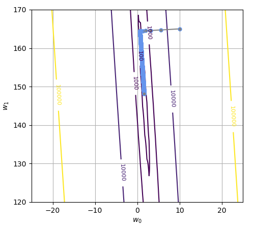  

* Predicted linear line plot:  
Mean squared error: 29.936629[$cm^2$]  
Standard deviation: 5.471[$cm$]  
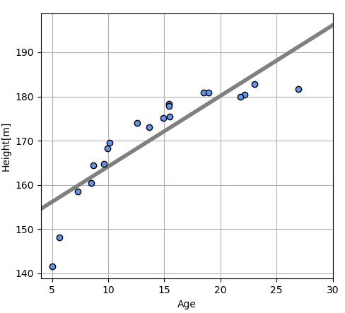

### Point to notice

The result which is solved by Gradient method is just a local minimum value and not always global minimum value. Practically, we need to try gradient method with various initial values and select the minimum result value.  

## Plane model with 2 dimensional input
---
In this case, data vector $x$ is extended to 2 dimensional data, $x=(x_0, x_1)$. $x_0$ is age and $x_1$ is weight.  

### Data generation
This data was generated by generate_2dimensional_plane_data.py  
$$
  Weight = 23 \times \frac{Height}{100}^2 + Noise
$$  
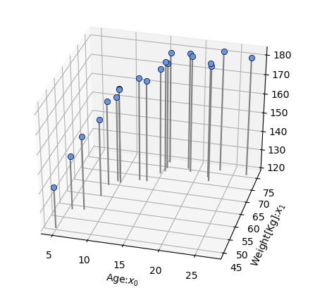

### Plane model
* Definition of surface function:  
$$
  y(x) = w_0 x_0 + w_1 x_1 + w_2
$$

* Mean squared error function:  
$$
  J = \frac{1}{N}\sum_{n=0}^{N-1}(y(x_n) - t_n)^2 = \frac{1}{N}\sum_{n=0}^{N-1}(w_0 x_{n,0} + w_1 x_{n,1} + w_2 - t_n)^2
$$

* Gradient:  
$$
  \frac{\sigma J}{\sigma w_0}=0, \frac{\sigma J}{\sigma w_1}=0, \frac{\sigma J}{\sigma w_2}=0
$$  

* Optimal parameters:  
$$
  w_0 = \frac {cov(t,x_1)cov(x_0,x_1)-var(x_1)cov(t,x_0)}{cov(x_0,x_1)^2-var(x_0)var(x_1)}
$$  
$$
  w_1 = \frac {cov(t,x_0)cov(x_0,x_1)-var(x_0)cov(t,x_1)}{cov(x_0,x_1)^2-var(x_0)var(x_1)}
$$  
$$
  w_2 = -w_0 \frac{1}{N}\sum_{n=0}^{N-1}x_{n,0}-w_1 \frac{1}{N}\sum_{n=0}^{N-1}x_{n,1}+\frac{1}{N}\sum_{n=0}^{N-1}t_n
$$  

* Learning result:  
This learning was executed by learning_plane_model.py  
$w_0=0.4$, $w_1=1.0$, $w_2=95.5$  
Standard deviation: 2.374[cm]  
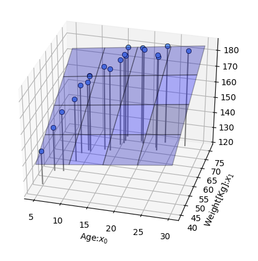

## D-dimensional Linear Regression Model

* It requires a lot of work to derive all of formulas at different dimension. So, we need to define the number of dimension as a variable, $D$.  

$$
  y(x) = w_0x_0 + w_1x_1 + \cdots + w_{D-1}x_{D-1} + w_D
$$  
* We can shorten the above model with Matrix representation.  
$$
  y(x) = \left[
            w_0 \cdots w_{D-1}
         \right]
         \left[
            \begin{array}{c}
              x_0 \\
              \vdots \\
              x_{D-1}
           \end{array}
         \right]
         = \bm{w}^{\mathrm{T}}\bm{x}
$$  

### Solution of model  
$$
  J(\bm{w}) = \frac{1}{N}\sum_{n=0}^{N-1}(y(x_n)-t_n)^2 = \frac{1}{N}\sum_{n=0}^{N-1}(\bm{w}^{\mathrm{T}}\bm{x}_n-t_n)^2
$$  
$$
  \frac{\partial J}{\partial w_i} = \frac{1}{N}\sum_{n=0}^{N-1} \frac{\partial}{\partial w_i} (\bm{w}^{\mathrm{T}}\bm{x}_n-t_n)^2 = \frac{2}{N}\sum_{n=0}^{N-1} \frac{\partial}{\partial w_i} (\bm{w}^{\mathrm{T}}\bm{x}_n-t_n)x_{n,i}
$$  
$$
  \sum_{n=0}^{N-1}(\bm{w}^{\mathrm{T}}\bm{x}_n-t_n)x_{n,i}=0
$$  
$$
  \sum_{n=0}^{N-1}(\bm{w}^{\mathrm{T}}\bm{x}_n-t_n)[x_{n,0},x_{n,1},\cdots,x_{n,D-1}]=\sum_{n=0}^{N-1}(\bm{w}^{\mathrm{T}}\bm{x}_n-t_n) \bm{x_n^{\mathrm{T}}}=[0\ 0\ \cdots\ 0]
$$  
$$
  \sum_{n=0}^{N-1}x_n x_n^{\mathrm{T}} = \bm{X}^{\mathrm{T}}\bm{X} \,,  \sum_{n=0}^{N-1}x_n x_n^{\mathrm{T}} = \bm{t}^{\mathrm{T}}\bm{X}
$$  
$$
  (\bm{w}^{\mathrm{T}}\bm{X}^{\mathrm{T}}\bm{X} - \bm{t}^{\mathrm{T}}\bm{X})^{\mathrm{T}} = [0\ 0\ \cdots\ 0]^{\mathrm{T}}
$$  
$$
  \bm{w} = (\bm{X}^{\mathrm{T}}\bm{X})^{-1}\bm{X}^{\mathrm{T}}\bm{t}
$$  
The right side of the above formula, $(\bm{X}^{\mathrm{T}}\bm{X})^{-1}\bm{X}^{\mathrm{T}}$ is called "Moore-Penrose Pseudo-inverse matrix".  

### Extension to plane not passing through origin

Vector $\bm{x}$ can be thought as 3 dimensional vector by adding 3rd element which is always "1". In case that $x_2 = 1$,  
$$
  y(\bm{x}) = w_0 x_0 + w_1 x_1 + w_2 x_2 = w_0 x_0 + w_1 x_1 + w_2
$$  

## Linear basis function
* Way of thinking  
$x$ of Linear Regression model is replaced with Basis function $\phi(x)$ to create a function which has various shapes.  

* Gaussian function  
Gaussian function is used as basis function in this section. Basis function is used as multiple sets and a suffix $j$ is attached in the formula. $s$ is a parameter to adjust a spread of the function.  
$$
  \phi_j(x) = exp\{ -\frac{(x-\mu_j)^2}{2s^2} \}
$$  

* Combined function of $M$ gaussian functions  
This figure is created gaussian_basis_function.py  
In order from left, $\phi_0(x)$, $\phi_1(x)$, $\phi_2(x)$, $\phi_3(x)$.  
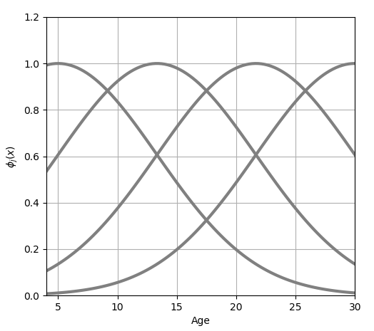  
$M$ is the number of combined functions. In the above, $M=4$
Weight parameters for each function: $w_0$, $w_1$, $w_2$, $w_3$  
A parameter for adjusting up and down movement of model: $w_4$  
$w_4$ is for a dummy function, $\phi_4(x)=1$.  
$$
  y(x,\bm{w})=w_0\phi_0(x)+w_1\phi_1(x)+w_2\phi_2(x)+w_3\phi_3(x)+w_4 \\
  y(\bm{x},\bm{w}) = \sum_{j=0}^{M}w_j\phi_j(\bm{x})=\bm{w}^{\mathrm{T}}\bm{\phi}(\bm{x})
$$  

* Mean squared error $J$  
$$
  J(\bm{w})=\frac{1}{N}\sum_{n=0}^{N-1}\{ \bm{w}^{\mathrm{T}}\bm{\phi}(\bm{x_n})-t_n \}^2
$$  

* Solution $\bm{w}$  
$$\bm{w}=(\bm{\phi^{\mathrm{T}}}\bm{\phi})^{-1}\bm{\phi^{\mathrm{T}}}\bm{t}$$  

* Preprocessed input data $\bm{\phi}$  
$\bm{\phi}$ is called "Design matrix".  
$$
  \bm{\phi} = \left[
            \begin{array}{c}
              \phi_0(\bm{x}_0) & \phi_1(\bm{x}_0) & \cdots & \phi_M(\bm{x}_0) \\
              \phi_0(\bm{x}_1) & \phi_1(\bm{x}_1) & \cdots & \phi_M(\bm{x}_1) \\
              \vdots & \vdots & \vdots & \vdots \\
              \phi_0(\bm{x}_{N-1}) & \phi_1(\bm{x}_{N-1}) & \cdots & \phi_M(\bm{x}_{N-1})
           \end{array}
         \right]
$$  

* Learning Result  
This learning was executed by learning_gaussian_function.py  
$w_0=62.2$, $w_1=71.8$, $w_2=30.4$, $w_3=110.6$, $w_4=31.9$  
Standard deviation: 1.43[cm]  
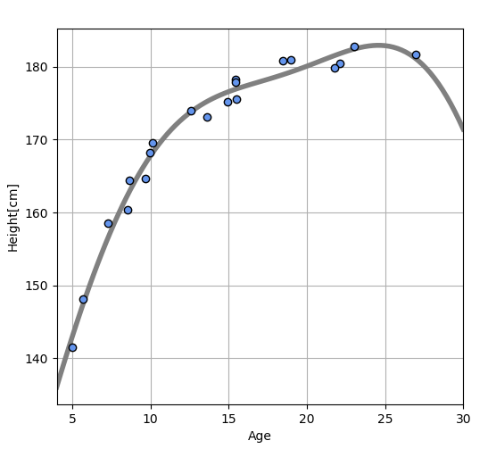  

## Overfitting problem  
Standard deviation of error is decreasing by insreasing the number of $M$ but, the basis function is getting more curved as follow.  
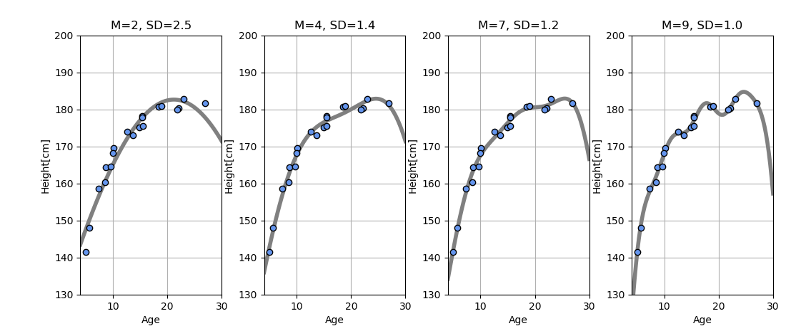  
This curve gets close to each sample points but it becomes deformed at a part where there is no sample point. This is called "over-fitting". The prediction for a new data will become bad.  

## Hold-out validation  
All of data, $\bm{x}$ and $\bm{t}$ are divided into "Test data" and "Training data". For this example, 1/4 of data is used for test and the rest, 3/4 is used for training. The parameter of model, $\bm{w}$ is optimized with only training data and a mean squared error for test data is calculated with the optimized parameter $\bm{w}$.  
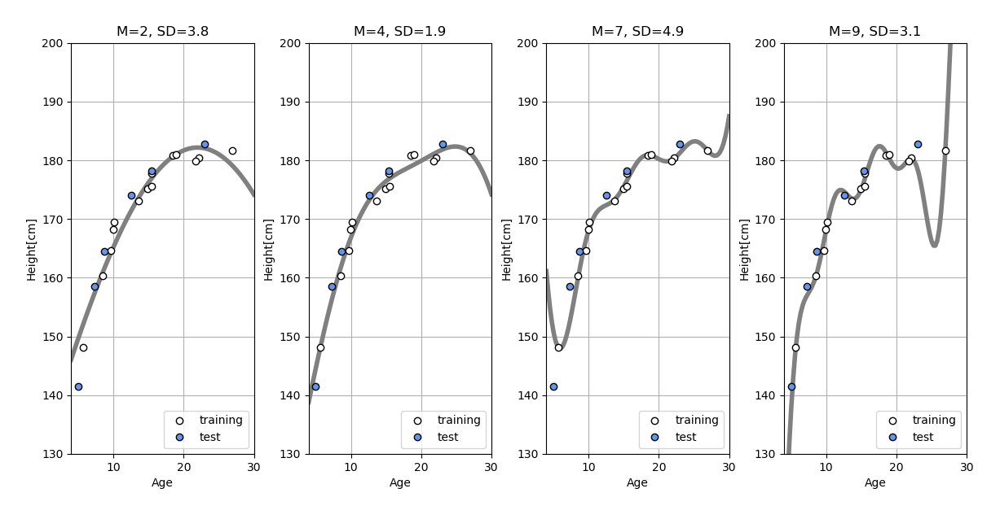  
In the above graphs, white points are training data and blue points are test data. If the number of $M$ is over than 4, standard deviation for test data gets worth and over-fitting occurs.  
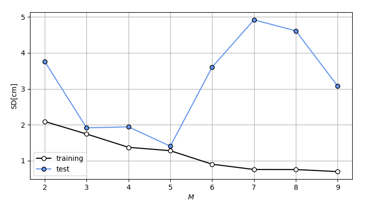  

## Cross-validation
The above result depends on how to select training data. This dendency is revealed prominently when the number of data is a few.  

